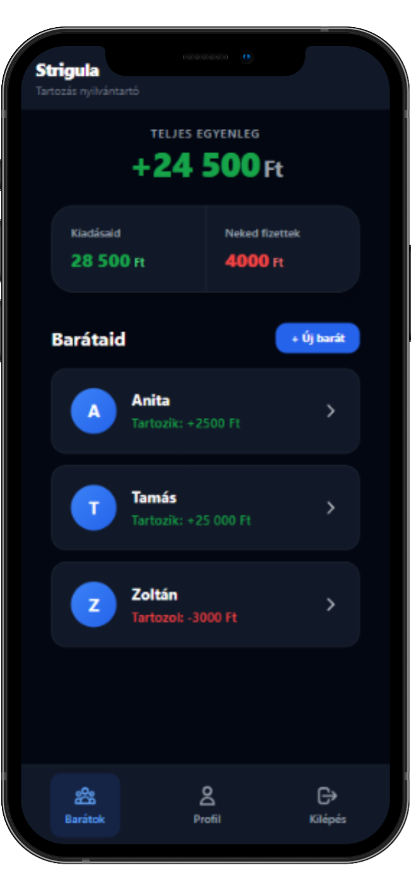
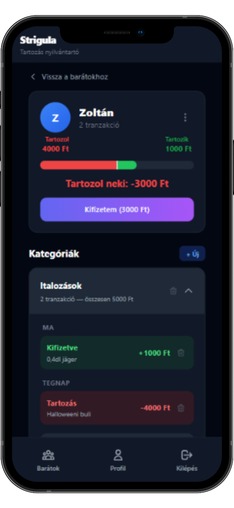

# Strigula — Shared Finance Tracker

Track shared expenses, know who owes whom, and settle up — effortlessly.

<p align="center">
  
  
  
  
  
</p>

<p align="center">
  
  
</p>

## Core Features

- **Installable PWA** — native-like experience on iOS and Android, launch from your home screen
- **Soft-delete pattern** — records are never physically destroyed, preserving financial audit trails
- **Real-time debounced search** — find friends instantly with 300ms debounce, no search button needed
- **CSV Export** — download all transactions in one click, UTF-8 BOM for Excel compatibility
- **Full dark mode** — system-aware theme with manual toggle, persisted across sessions
- **Zombie record revival** — deleted friend requests and friendships are resurrected instead of duplicated
- **Responsive design** — fixed sidebar on desktop, thumb-friendly bottom nav on mobile

## Tech Stack

| Category  | Technology |
|-----------|------------|
| **Frontend** | React 19, Vite 7, Tailwind CSS 3, React Router 7, Axios |
| **Backend** | Django 6.0, Django REST Framework 3.15, Djoser 2.3 |
| **Database** | PostgreSQL 15 (decimal precision, CHECK constraints, MVCC) |
| **DevOps** | Docker, Docker Compose, bind mounts with hot-reload |

## Quick Start

```bash
# 1. Clone the repository
git clone https://github.com/core-ter/strigula.git
cd strigula

# 2. Create the environment file
cp .env.example .env

# 3. Start all services
docker compose up -d --build

# 4. Run database migrations
docker compose exec backend python manage.py migrate

# 5. Create a superuser (optional)
docker compose exec backend python manage.py createsuperuser
```

Open **http://localhost:5173** — the app is ready.
